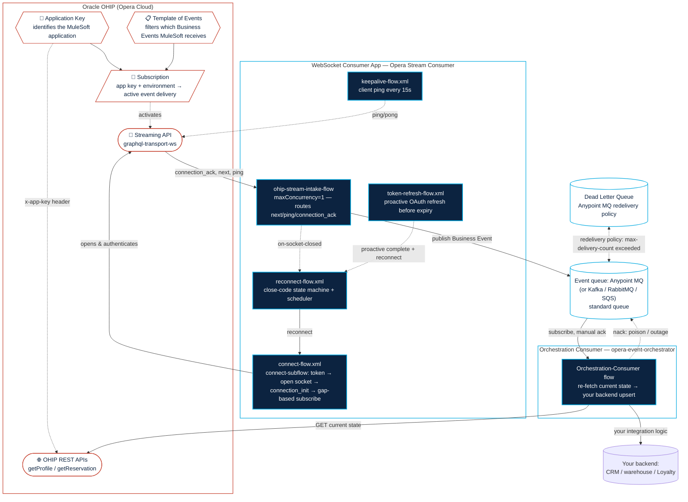

# Opera Streaming Solution for MuleSoft

A two-app MuleSoft reference solution for consuming Oracle OHIP (Opera Cloud) **Business Events**
from the OHIP **Streaming API** and processing them reliably:

1. **[`opera-stream-consumer/`](opera-stream-consumer/)** — a Mule 4 app that creates a GraphQL subscription over WebSockets to OHIP, and handles the full connection lifecycle (auth, keepalive,
   token refresh, close-code-aware reconnect), and publishes each Business Event to a durable AnypointMQ Message Exchange.
2. **[`opera-event-orchestrator/`](opera-event-orchestrator/)** — a
   companion Mule 4 app that drains that queue and, following Oracle's **Orchestration** pattern, treats each event as a trigger, re-fetching the changed resource's current state from the OHIP REST API and upserts it. It is the plug-in point for your own backend integration.

Plus an **optional HA variant** of app 1:

3. **[`opera-stream-consumer-ha/`](opera-stream-consumer-ha/)** — the same GraphQL subscription consumer plus Oracle's
   **symmetric competing-consumer** connection-status-check + jittered-failover pattern, toggled with
   `ohip.ha.enabled`. All instances are identical: scale it to N replicas in a region (auto-spread across
   availability zones) and/or deploy it in additional regions for cross-region DR — OHIP's global lock
   arbitrates across all of them. Leave HA off and it behaves exactly like app 1. See its
   [README](opera-stream-consumer-ha/README.md#deployment-topologies).

See each app's own README for setup, configuration, and design rationale. A local
[OHIP simulator](opera-stream-consumer/sim/) lets you exercise the whole flow end-to-end without a
live Oracle tenant.

> ### ⚠️ Community-built asset
> This is a **community-built** reference asset shared to help MuleSoft developers integrate with
> Oracle OHIP. It is **not an official product of, nor supported by, MuleSoft or Salesforce.** That said, it's built to reference quality
> and kept genuinely useful — **feedback, issues, and pull requests are very welcome.** Use it as a
> starting point, adapt it to your environment, and please contribute improvements back.

## Layout

```
opera-streaming-solution/
├── solution.code-workspace              open THIS in VS Code
├── opera-stream-consumer/                 app 1 — WebSocket consumer
├── opera-stream-consumer-ha/              app 1 + symmetric competing-consumer HA
├── opera-event-orchestrator/            app 2 — orchestration queue consumer
└── LICENSE
```

## Prerequisites

- For local trials: just Node.js (for the simulator), Anypoint MQ and a MuleSoft development environment (ACB or Studio)
- For live environments: An Oracle OHIP tenant, OHIP Template of Events and application key as well as an Anypoint MQ and Mule deployment environment


## Architecture Overview

Three moving pieces, in sequence: a **WebSocket consumer app** (this template) turns Oracle's
push-based Stream into durable messages published to an **Anypoint MQ exchange** (fanned out to a
bound standard queue); an **event queue** decouples that fast intake from a possibly-slow backend;
and an **orchestration consumer** (the companion
`opera-event-orchestrator` app) drains the queue and is where you plug
in real backend logic the consumer re-fetches current resource state
per event

This template uses **Anypoint MQ** for the queue as it's a quick, production grade messaging solution for exactly these types of processing patterns but Oracle's own guidance treats the queue as a swappable buffer, not a specific
product — the docs explicitly call out **Apache Kafka**, **RabbitMQ**, and **Amazon SQS** as
equally valid choices (see the design-decision table below). Swapping in a different broker only
touches the `anypoint-mq:publish`/`anypoint-mq:subscriber` operations in `connect-flow.xml` and
the consumer app — the rest of the WebSocket handling is unaffected.



### Flow-by-flow purpose

#### opera-stream-consumer
| Flow file | Purpose |
|---|---|
| `connect-flow.xml` | Holds the shared `connect-subflow` (fetch OAuth token → open the Stream WebSocket → send `connection_init` → resolve and send a gap-based `subscribe`) plus `ohip-startup-connect-flow` (opens the Stream on deploy and self-heals if it's ever unexpectedly closed) and `ohip-stream-intake-flow` (the ordered, single-threaded `maxConcurrency=1` listener that routes each frame by type: `connection_ack` → subscribe, `next` → publish the Business Event to MQ, `ping` → reply `pong`). |
| `keepalive-flow.xml` | Sends the client-initiated `ping` OHIP requires every ~15 seconds; a no-op when no socket is open. |
| `reconnect-flow.xml` | The close-code state machine: routes each WebSocket close by its numeric code (`4401`/`4403`/`4409`/`4504`/`1006`/other) to the right reaction (reconnect now, halt, or back off and schedule a reconnect), plus the `reconnect-scheduler-flow` that polls for a due reconnect and retries `connect-subflow`. |
| `token-refresh-flow.xml` | Proactively refreshes the OAuth token before it expires — sends `complete`, waits the required 10s gap, then reconnects with a fresh token — so the Stream never has to hit the reactive `4401` path as its normal refresh mechanism. |
| `global.xml` | Shared connector configs, cross-flow Object Stores, and the Anypoint MQ config referenced by the flows above. Swap this config (and the `publish`/`subscriber` operations that reference it) for Kafka/RabbitMQ/SQS equivalents if you'd rather use a different broker — see [Architecture Overview](#architecture-overview). |

#### opera-event-orchestrator
| Flow file | Purpose |
|---|---|
| `opera-event-orchestrator.xml` | Subscribes to the standard queue with manual acknowledgement and, per event, re-fetches the changed resource's current state from OHIP REST (`getProfile`/`getReservation`) and upserts it — the developer's plug-in point for real backend processing. A subscriber circuit breaker guards against an OHIP outage; poison messages `nack` toward the queue's DLQ. |


## Sizing: Flows & message consumption

### Flow count

| App | Flows | The message source in each |
|---|---:|---|
| `opera-stream-consumer` | **6** | `scheduler` connect-check (30s) · `scheduler` keepalive ping (15s) · `scheduler` reconnect-check (5s) · `scheduler` token-refresh-check (30s) · `websocket:outbound-listener` stream intake · `websocket:on-socket-closed` |
| `opera-stream-consumer-ha` | **7** | the 6 above **+** `scheduler` HA status-poll (15s) — the extra flow in `ha-failover-flow.xml` |
| `opera-event-orchestrator` | **1** | `anypoint-mq:subscriber` |
| **Total (base pair)** | **7** | `opera-stream-consumer` + `opera-event-orchestrator` |
| **Total (HA)** | **7·N + 1** | (`opera-stream-consumer-ha` × N instances) + `opera-event-orchestrator`. N is your chosen replica count summed across all regions — e.g. N=2 → 15. |

### Message consumption formula

A "message" = one execution of a source. Over an observation window of **T seconds**, per deployed
instance:

```
messages(T) ≈ scheduler_fires + websocket_frames + socket_closes + mq_events

where, for the streaming app (per instance):
  scheduler_fires   = T/30 (connect) + T/15 (ping) + T/5 (reconnect) + T/30 (token)   [+ T/15 HA poll]
  websocket_frames  = business_events_delivered + protocol_frames(connection_ack, ping/pong, complete)
  socket_closes     = number of disconnects in T   (one message per close)

for the orchestrator (per instance):
  mq_events         = business_events_dequeued     (1 message per event; the 1s poll that finds an
                      empty queue does NOT bill — only a delivered message counts)
```

**Idle baseline (streaming app, no events, no disconnects), messages/hour per instance:**

```
single replica opera stream consumer configuration: 3600/30 + 3600/15 + 3600/5 + 3600/30  = 120 + 240 + 720 + 120        = 1,200 /hr
HA opera stream consumer configuration  : 1,200 + 3600/15 (status poll)          = 1,200 + 240                  = 1,440 /hr
```

Add `websocket_frames` (roughly one intake message per Business Event, plus keepalive/ack protocol
frames) and one message per reconnect on top of that baseline. The orchestrator adds ~one message per
Business Event it dequeues. **Multiply by instance count** — the HA variant runs **N** identical
instances (your replica count summed across regions), so its scheduler baseline is `N × 1,440 /hr`
(e.g. 2 instances → `2,880 /hr`) while only one instance holds the subscription and receives event
frames at a time.

> The scheduler frequencies above are the shipped defaults (`ohip.tokenRefresh.checkIntervalMs=30000`,
> `ohip.ha.statusPollIntervalMs=15000`, and the hard-coded 30s/15s/5s schedulers). Raising any interval
> lowers the idle message count.
