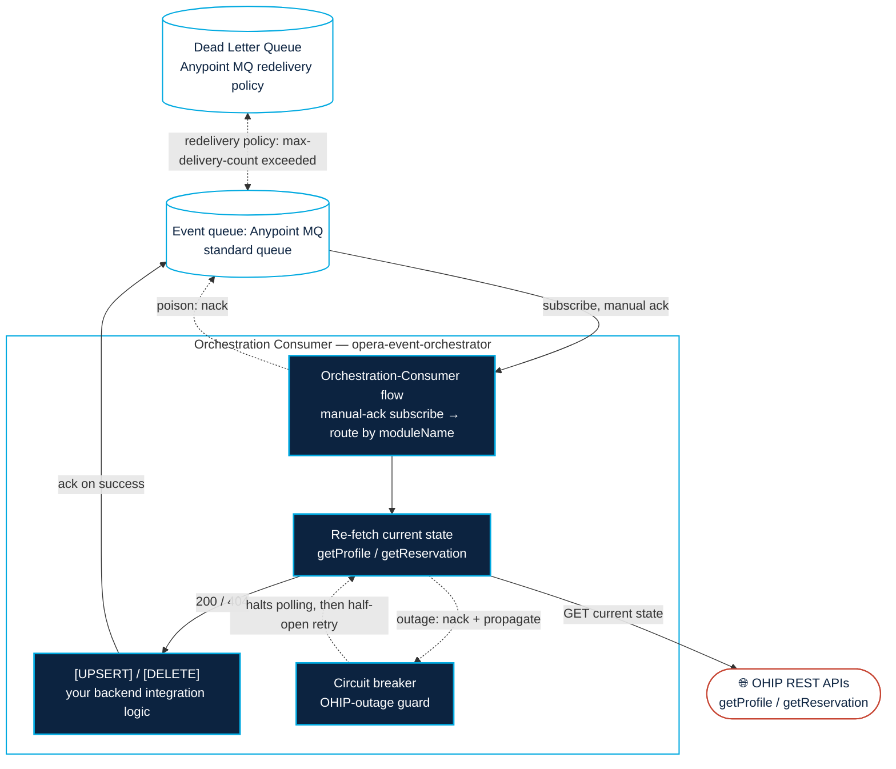

# Anypoint MQ Orchestration Event Processor

The companion consumer app for the [Opera Stream Consumer](../opera-stream-consumer/). It drains
the Anypoint MQ queue that the streaming app publishes OHIP Business Events to and, following Oracle's
**Orchestration** pattern, treats each event as a **trigger**: it re-fetches the current state of the
changed resource from the OHIP REST API and upserts that latest state into your backend. It is the
plug-in point for your own backend integration.

Reference-quality; part of a **community-built** solution (see the
[top-level README](../README.md)).

## Architecture



## What it does

The single `Orchestration-Consumer` flow (`src/main/mule/opera-event-orchestrator.xml`):

1. **Subscribes** to the queue named in `ohip.mq.consumerDestination` with **manual acknowledgement**,
   using the **polling** strategy with `maxConcurrency=${ohip.mq.consumerConcurrency}`.
2. **Parses** the JSON Business Event once and reuses it downstream.
3. **Ensures a valid OHIP OAuth token** — client-credentials, cached in an Object Store, refreshed only
   when expired (see [OAuth](#oauth) below).
4. **Routes by `moduleName`/`eventName`** to the matching OHIP REST GET, keyed on the event's
   `primaryKey` (e.g. `PROFILE` → `getProfile(profileId)`, `RESERVATION` → `getReservation(hotelId, reservationId)`).
5. **Upserts** the fetched current state — this is a **stub Logger you replace** (the plug-in point).
6. **Error handling:**
   - **`404` on the fetch → delete.** The resource was removed between the event and our read; mapped to
     a backend delete (plug-in point), not an error.
   - **OHIP outage → nack + propagate → trips the circuit breaker.** Connectivity/timeout/5xx from the
     re-fetch (OHIP is *down*) are handled with `on-error-propagate` (nack, then propagate) so the
     subscriber's **circuit breaker** counts them; enough in a row halts MQ polling for a cooldown instead
     of nack-looping the backlog toward the DLQ. See [Circuit breaker](#circuit-breaker-ohip-outage-guard).
   - **Any other failure → `nack`** toward the queue's Dead Letter Queue after its max-delivery-count.
   - An unmapped `moduleName` is raised as `APP:UNSUPPORTED_EVENT` and routed to the DLQ rather than
     silently acked.

## The developer's plug-in point

Two Loggers marked `[UPSERT]` and `[DELETE]` are the plug-in points. Replace them with your backend
integration logic (PMS, CRM, data warehouse, etc.):

- **`[UPSERT]`** runs after a successful GET. `vars.currentResource` holds the **latest** resource state.
- **`[DELETE]`** runs on a `404`. Delete the resource in your backend keyed on `primaryKey`.

**Keep the `ack`/`nack` error-handler structure** so `404`s map to deletes, poison messages route to the
DLQ, and the consumer never stalls.


## OAuth

The OHIP token endpoint (`POST /oauth/v1/tokens`) is called with **preemptive HTTP basic-auth**
(`clientId`/`clientSecret`, out-of-the-box on the connector) **plus a required `x-app-key` header**.

The token is cached in the in-memory `tokenStateOs` Object Store and refreshed only when it is within
60s of expiry, so the token call is not made per event.

## Circuit breaker (OHIP-outage guard)

Under Orchestration the consumer depends on OHIP REST being reachable — it re-fetches current state on
every event. When **OHIP is down** (connectivity refused, timeouts, 5xx), *every* re-fetch fails; without
a breaker the consumer would nack the whole backlog and, after each event's max-delivery-count, **DLQ a
pile of otherwise-good events** while simply hammering a dead dependency.

The subscriber has a private `<anypoint-mq:circuit-breaker>` scoped to **dependency outage**. When enough consecutive OHIP-down failures occur, it **OPENS**: MQ polling halts
and in-flight messages are nacked for `tripTimeout`, then a half-open trial fetch tests recovery. Config:

| Property | Default | Meaning |
|---|---|---|
| `ohip.mq.cb.onErrorTypes` | `HTTP:CONNECTIVITY,HTTP:TIMEOUT,HTTP:SERVICE_UNAVAILABLE,HTTP:BAD_GATEWAY,HTTP:GATEWAY_TIMEOUT` | HTTP errors that mean "OHIP unreachable / down". Drives **both** the breaker and the flow's `on-error-propagate` `type`, so the list is defined once. Excludes `HTTP:NOT_FOUND` (404-as-delete success) and `HTTP:TOO_MANY_REQUESTS` (429, not the breaker). |
| `ohip.mq.cb.errorsThreshold` | `5` | Failures counted before OPENing. **Keep low relative to the queue's max-delivery-count** (e.g. `max_deliveries=10`) so the breaker trips *before* an outage burns redeliveries and DLQs good events. Counting is **strictly consecutive**: *any* success — a clean event, a 404-as-delete, a poison nack, or an error type not in `onErrorTypes` — resets the counter to 0. So only a *full* outage (every re-fetch failing) climbs to the threshold; a flaky/partial OHIP keeps resetting and won't trip (by design — that's poison/429 territory). |
| `ohip.mq.cb.tripTimeout` | `30` | How long the breaker stays OPEN (polling halted) before a half-open trial. **Hard floor of 1000 ms** — the connector throws at startup if `tripTimeout` resolves below one second. |
| `ohip.mq.cb.tripTimeoutUnit` | `SECONDS` | Time unit for `tripTimeout`. |

> **Why the error handler has two branches.** The connector counts a breaker failure **only when the flow
> finishes with an error _propagation_** (`CircuitBreakerConfiguration` javadoc: *"Error counts only when
> the flow is completed with an error propagation"*). `on-error-continue` looks like *success* to the
> runtime, so a breaker over a continue-everything handler would **never trip**. Hence OHIP-down errors use
> `on-error-propagate` (nack + propagate → breaker counts), while genuine poison keeps `on-error-continue`
> (nack → DLQ, must not count as an outage). The explicit nack on the propagate path is required: in MANUAL
> ack mode the connector does not auto-nack on propagate.

**Try it locally.** The OHIP simulator serves the re-fetch stubs and can fake an outage:

```
# force every REST re-fetch to 503 (or: scenario=timeout | up)
curl "http://localhost:8081/control/rest?scenario=down"
curl "http://localhost:8081/control/emit?n=10"      # push events; watch the breaker trip after errorsThreshold
curl "http://localhost:8081/control/status"          # shows restScenario
curl "http://localhost:8081/control/rest?scenario=up"   # recover; breaker half-opens then closes
```

## Tuning & further optimization

Current defaults target **moderate volume**. Knobs, in the order you'd reach for them:

| Knob | Where | Effect |
|---|---|---|
| `ohip.mq.consumerConcurrency` | `config.properties` | Events processed in parallel. Raise this toward whichever binds first: backend write capacity **or OHIP REST rate limits**. |
| Poll `frequency` | `opera-event-orchestrator.xml` | How often to fetch from MQ. |
| Horizontal scale (workers) | Runtime Manager | Add CloudHub workers on the same standard queue; the broker load-balances across them.

**Follow-ups to know:**

- **Read-after-write lag.** A GET immediately after a change can return slightly stale data
  (Oracle notes this). The upsert-latest model tolerates it; a subsequent event re-reads.

## Configuration

Non-secret values in `src/main/resources/config.properties`; secrets in `secure.properties` (never
committed — copy `secure.properties.sample`, fill in, and encrypt).

| Property | Description |
|---|---|
| `anypoint.mq.url` | Anypoint MQ region endpoint for your org/environment |
| `ohip.mq.consumerDestination` | The **standard queue** this app subscribes to (bound to the exchange the streaming app publishes to) |
| `ohip.mq.consumerConcurrency` | Events processed in parallel (plain concurrency; not a FIFO group count) |
| `ohip.mq.cb.*` | Circuit breaker thresholds/error-types — see [Circuit breaker](#circuit-breaker-ohip-outage-guard) |
| `ohip.host` / `ohip.port` / `ohip.httpProtocol` | OHIP gateway for the REST re-fetch + OAuth (mirrors the streaming app) |
| `ohip.oauthScope` | OAuth scope for the client-credentials token request |
| `anypoint.mq.clientId` / `anypoint.mq.clientSecret` *(secure)* | Anypoint MQ client-app credentials |
| `ohip.clientId` / `ohip.clientSecret` / `ohip.appKey` / `ohip.enterpriseId` *(secure)* | OHIP OAuth credentials + Application Key (sent raw as the required `x-app-key` header on the token + REST calls) + optional `enterpriseId` |

**Prerequisite infra (you provision this in Runtime Manager / Anypoint MQ admin):**

1. A **standard queue** (`your-queue-name`) bound to the streaming app's exchange
   (`dev-opera-stream-exchange`), which `ohip.mq.consumerDestination` points at. Create the exchange, queue, binding, and
   DLQ in the Anypoint MQ admin console.
2. A **Dead Letter Queue** on that queue with a **max-delivery-count**. The app relies on this
   redelivery policy for poison messages but cannot create it.

**Fan-out to multiple consumers.** Because the streaming app publishes to an exchange, adding another
consumer (audit, analytics) is purely an infra change: bind its own standard queue to the same exchange
— no publisher change.
