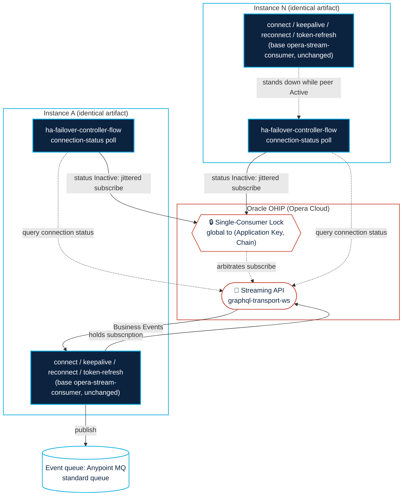

# Opera Stream Consumer — HA variant (symmetric competing consumer)

> **Set Up Steps are exactly the same as other README.** See
> [`opera-stream-consumer`](../opera-stream-consumer/README.md) for the Quickstart, Configuration
> (baseline + tunables), Secure Properties setup, local simulator instructions, and the developer's
> plug-in point. This README covers only what's **net new** in the HA variant.

This app is the base `opera-stream-consumer` plus one behavioral addition —
[`src/main/mule/ha-failover-flow.xml`](src/main/mule/ha-failover-flow.xml) — implementing Oracle's
**connection-status-check + jittered-failover** pattern (Streaming API Oracle's Streaming API Guide), toggled by
`ohip.ha.enabled`. With `ohip.ha.enabled=false` it behaves **exactly** like the base app for stream
consumption — it just carries one extra gated poller (the `ha-failover-controller-flow` scheduler),
which still fires on its interval but no-ops while HA is off

## Architecture

## Why and when to use this

OHIP Streaming API enforces a **Single-Consumer Lock**: only one active **event subscription** per (Application Key,
Chain) is allowed; a second one is rejected with close code `4409`.

To avoid downtime in case of a stream consumer fails - like if an AWS availability zone or region goes out - this app can be deployed across multiple replica's in region or across region.

For the Cloudhub 2.0 deployment model:
- To achieve in-region high availability, select 2 replica's at deployment. This automatically distributes the app across multiple availability zones in AWS
- To achieve cross-region high-availability deploy this app in 2 different Cloudhub 2.0 regions, and when you create your Anypoint MQ queues in the admin console, ensure "Cross-Region Failover" is enabled

**Note: scaling the stream consumer app to multiple replica's does not improve performance, only one replica will ever be connected to the OHIP streaming API at any given time.**

## How it works

Run N of them against the same
(Application Key, Chain), any way you like (see [Deployment topologies](#deployment-topologies)). Each
instance, while it does **not** hold the stream:

1. Opens the Stream socket and sends `connection_init` (`connect-subflow`, unchanged from base).
2. Runs `query { connection { id status } }` (`ha-send-status-query-subflow`).
3. On `status == "Inactive"`, waits a **jittered delay**, then sends the event `subscribe` to take over.
   On `status == "Active"`, stands down and keeps polling.
4. Whoever's `subscribe` lands first wins the lock. The losers get `4409` and the **base**
   `reconnect-flow.xml` applies the documented 2min+jitter backoff, then re-probe — no new code.

**Symmetric jitter:** every instance uses the same `ohip.ha.takeoverDelayMs` (default 1s) plus a random
`0..takeoverJitterMaxMs`, so a tie between any number of instances resolves randomly without a `4409`
storm. No instance is privileged. When the holder dies, the first surviving instance to observe
`Inactive` on its poll takes over within `takeoverDelayMs + jitter`. Under **Orchestration** (the design notes)
the consumer always re-fetches current state, so which instance/region holds the lock is not a
correctness concern — there is no reason to prefer a specific one. (See the design notes;
this supersedes the `active`/`standby` role bias in the design notes.)

## Configuration

All HA knobs are in [`config.properties`](src/main/resources/config.properties) under the HA block and
overridable at deploy time (`-Dohip.ha.*`):

| Property | Default | Purpose |
|---|---|---|
| `ohip.ha.enabled` | `true` | `false` → behaves **exactly** like the base single-consumer app. `true` → symmetric competing consumer. |
| `ohip.ha.statusPollIntervalMs` | `15000` | How often a passive instance re-checks connection status. |
| `ohip.ha.takeoverDelayMs` | `1000` | Base delay before an instance subscribes after seeing `Inactive` (same for all instances). Raise it on a non-preferred region's deployment to bias a preferred region. |
| `ohip.ha.takeoverJitterMaxMs` | `4000` | Random jitter added to the takeover delay (breaks ties, per Oracle's Streaming API Guide). |

> **The state store is per-instance on purpose.** The HA coordination state (`haStateOs`) is per-instance
> and non-persistent by design — instances coordinate through OHIP (the status query + the `4409` lock),
> not through a shared store. This is exactly why scaling to N replicas is safe now: each replica
> competes independently and OHIP is the single coordinator, so there's no shared store to get out of
> sync and no split-brain to manage.

## Demo failover against the local simulator

The simulator ([`../opera-stream-consumer/sim/ohip-sim.js`](../opera-stream-consumer/sim/ohip-sim.js))
enforces the lock at the **subscribe** level and answers the status query, matching real OHIP — so you
can watch a real handoff locally (the two instances are identical; there's no active/standby):

1. Start the sim: `node ../opera-stream-consumer/sim/ohip-sim.js`
2. Start **instance A** with `-Dohip.ha.enabled=true` (and `-Dmule.key=…`).
   Watch: connect → `connection_ack` → status query → `Inactive` → subscribe → Business Events flow.
3. Start **instance B** with the **same** `-Dohip.ha.enabled=true`. Watch: it connects and polls, sees
   `Active` (A holds the lock), and **stays passive** — no `4409` storm.
4. Kill instance A (or `curl "http://localhost:8081/control/close?code=1000"`). On B's next poll it sees
   `Inactive`, waits `takeoverDelayMs + jitter`, subscribes, and starts receiving events.
5. Restart A. It probes, sees `Active` (B now holds it), and stays passive until B drops — whichever
   instance is free first when the lock opens wins the jittered race.
