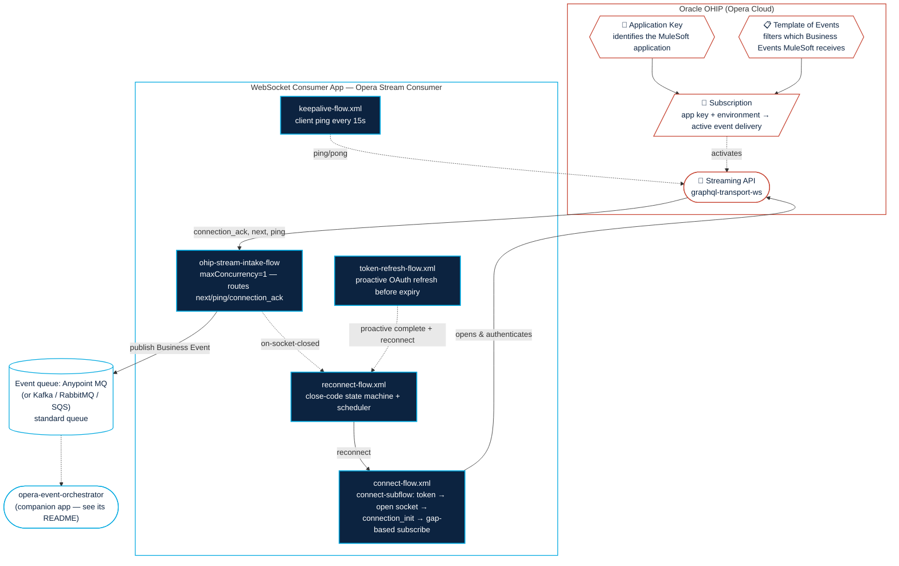

# Opera Stream Consumer

A reference-quality Mule 4 application that consumes Oracle OHIP (Opera Cloud) **Business Events**
from the OHIP **Streaming API** over a `graphql-transport-ws` WebSocket, following Oracle's
documented best practices. Intended for internal and external Mule developers integrating with
Opera Cloud.

## Architecture



## Quickstart

Get a sandbox chain streaming events onto Anypoint MQ in about 15 minutes.

**If you just want to run the Mule app against the local simulator, do steps 2 and 5.**

1. **Retrieve the required details from the Oracle OHIP Developer Portal.** Register a
   **MuleSoft-dedicated** application against your UAT/sandbox tenant and pull everything listed in
   [Bare minimum to run](#baseline) below (host, chain code, OAuth credentials,
   Application Key, etc.) — see Oracle's
   [Streaming API Guide](https://docs.oracle.com/en/industries/hospitality/integration-platform/stmig/)
   for exactly how to obtain each value from the portal. **Give MuleSoft its own Application Key and
   a Template of Events scoped to only the events it needs** — this is the single biggest lever on both
   correctness and message consumption; see
   [Set up a dedicated OHIP Application Key for MuleSoft](#set-up-a-dedicated-ohip-application-key-for-mulesoft).
   Confirm your environment owner has **approved the event subscription** — events won't flow without
   this approval.
2. **Provision the Anypoint MQ exchange and queue.** Create the **message exchange** named in
   `ohip.mq.destination` (this app publishes to the exchange, not directly to a queue), then create
   the consumer's **standard queue** (`ohip.mq.consumerDestination`) and **bind it to that exchange**. Grab an MQ client-app `clientId`/`clientSecret`. Publishing to an exchange
   lets you fan out to additional consumers later by binding more queues — no publisher change.
3. **Fill in the config.** Edit `src/main/resources/config.properties` with your host, port,
   and `ohip.chainCode`. Copy `secure.properties.sample` → `local.secure.properties` and fill in
   the real secrets from steps 1 and 2.
4. **Encrypt the secrets** with the MuleSoft Secure Properties Tool using a master key of your
   choosing (see [Setting up Secure Properties](#setting-up-secure-properties) below).
5. **Optional: build and deploy locally against the simulator.**
   No live Oracle tenant yet? See
   [Running against the local simulator](#running-against-the-local-simulator) below — `sim/ohip-sim.js`
   is a local stand-in for OHIP that lets you exercise the whole flow end-to-end before touching a
   real sandbox, with `config.properties` already pointed at it out of the box.
   Test the apps in Anypoint Studio or Code Builder against the sim, and set the
   [environment property](https://docs.mulesoft.com/cloudhub-2/ch2-manage-props#example-using-properties-to-set-environment-variables)
   `mule.key=mulesoft` (or replace it with your own secure key). To pass it via a launch configuration locally, see
   [Anypoint Code Builder](https://docs.mulesoft.com/anypoint-code-builder/int-run-mule-apps-with-properties#use-environment-variables-in-launch-configurations)
   or [Anypoint Studio](https://docs.mulesoft.com/mule-runtime/latest/configuring-properties#setting-environment-variables-in-anypoint-studio).
6. **Deploy `opera-stream-consumer` to a single replica and verify the handshake.** See
   [Competing-consumer HA pattern](#competing-consumer-ha-pattern) for why this app should run as one replica.
   Confirm the logs show: OAuth token obtained → WebSocket opened →
   `connection_ack` received → `subscribe` sent. Then, in the sandbox, create or update a record
   (e.g. a profile) and confirm a `next` frame with a populated `eventName`/`primaryKey` shows up
   in the logs and lands on the Anypoint MQ exchange (and, via the binding, its queue).
7. **Deploy the companion `opera-event-orchestrator` app.** Point it at `ohip.mq.consumerDestination` (the queue bound
   to the exchange in step 2), and replace its stub Logger with your real backend integration (see
   [The developer's plug-in point](#the-developers-plug-in-point)). Deploy the
   **opera-event-orchestrator** app with the
   [environment properties](https://docs.mulesoft.com/cloudhub-2/ch2-manage-props#example-using-properties-to-set-environment-variables)
   `mule.key=mulesoft` (or your own secure key) and `anypoint.mq.subscriber.backpressure.enabled=true`.


## Set up a dedicated OHIP Application Key for MuleSoft

> An external integration like MuleSoft should be issued its **own**
> Application Key in the OHIP Developer Portal — not one shared with other API clients. This ensures MuleSoft receives only the events it needs, which directly **lowers MuleSoft message
> consumption**. This is
> standard OHIP/Opera configuration — your (or the customer's) **Opera/OHIP administrator** does it in
> the Developer Portal.

### What a MuleSoft specific application key enables

- **Scoped subscription = fewer messages.** Using OHIP's **"Template of Events"**, a dedicated
  application subscribes to **only** the events MuleSoft needs (e.g. `Check In`, `Update Reservation`),
  optionally filtered by data element and condition. Every event you *don't* subscribe to is a Mule
  message you never pay to process.
- **Prevents self-echo** OHIP's `x-externalSystem` header on a REST **write** suppresses
  Business Events **for the same Application Key that made the write** (so an app doesn't "echo" its own
  changes back to itself).
- **Avoids the single-consumer collision.** A Stream is `gateway + chainCode + Application Key`, and
  only one active subscriber is allowed per that tuple — a second connection on the same key/chain is
  rejected with close code **4409**. A dedicated key keeps MuleSoft out of that contention.

**Oracle references:**
[Working with Events in the Developer Portal](https://docs.oracle.com/en/industries/hospitality/integration-platform/ohipu/t_working_with_events_in_developer_portal.htm)
·
[Application Key](https://docs.oracle.com/en/industries/hospitality/integration-platform/stmig/c_application_key.htm)
·
[Suppressing Events from Your Own REST Calls](https://docs.oracle.com/en/industries/hospitality/integration-platform/stmig/c_suppressing_events_from_your_own_rest_calls.htm)


## Configuration

### Baseline

Everything below is a value you must retrieve from the Oracle OHIP Developer Portal or the
Anypoint MQ admin console. The non-secret ones ship with sim/placeholder defaults in
`config.properties` (pointed at the local simulator) that you **must replace for a real tenant** —
including `anypoint.mq.url`. Non-secret values go in
`src/main/resources/config.properties`. Secrets go in `secure.properties`. See
`secure.properties.sample` for the dummy-value template, and `secure.properties.encrypted.sample`
for a working encrypted example.

| Property | Description | Where to get it |
|---|---|---|
| `ohip.host` | OHIP API/Stream host | Oracle OHIP tenant provisioning |
| `ohip.chainCode` | Chain to subscribe to | Hotel chain admin / OHIP config |
| `ohip.oauthScope` | OAuth scope for the token request | Oracle OHIP docs (`urn:opc:hgbu:ws:__myscopes__`) |
| `anypoint.mq.url` | Anypoint MQ region endpoint | Anypoint MQ admin console |
| `ohip.mq.destination` | **exchange** this app publishes Business Events to | Anypoint MQ admin console |
| `ohip.mq.consumerDestination` *(companion app's `config.properties`, not this app's)* | **standard queue** the consumer subscribes to (bound to the exchange above) | Anypoint MQ admin console |
| `ohip.clientId` / `ohip.clientSecret` *(secure)* | OAuth client-credentials for the token endpoint | Oracle OHIP application registration |
| `ohip.appKey` *(secure)* | Application Key — SHA-256 hashed into the WebSocket `?key=` handshake param, and sent raw as `x-app-key` on the OAuth token request and in the `connection_init` payload (one value, one secret) | Oracle OHIP application registration |
| `ohip.enterpriseId` *(secure)* | Enterprise ID header (client-credentials environments) | Oracle OHIP tenant provisioning |
| `anypoint.mq.clientId` / `anypoint.mq.clientSecret` *(secure)* | Anypoint MQ client-app credentials | Anypoint MQ admin console |

For exactly how to retrieve each Oracle-sourced value from the portal, see Oracle's
[Streaming API Guide](https://docs.oracle.com/en/industries/hospitality/integration-platform/stmig/).

### Tunable parameters

Everything below already ships with a sensible default in `config.properties`. Adjust only if you
have a reason to (e.g. a stricter SLA, or Oracle changes a documented timing).

| Property | Description | Default |
|---|---|---|
| `ohip.reconnect.wait4409Ms` / `...JitterMaxMs` | Single-Consumer Lock (4409) reconnect wait + jitter | 2 min + up to 30s jitter |
| `ohip.reconnect.wait4504Ms` | Service timeout (4504) reconnect wait | 15s |
| `ohip.reconnect.waitDefaultMs` | Reconnect wait for routine closes (e.g. `1000`/`1001`) | 0ms (immediate) |
| `ohip.reconnect.wait1006Ms` | Abnormal closure (1006) reconnect wait | 4s |
| `ohip.reconnect.schedulerPollMs` | How often the reconnect scheduler checks for a due reconnect | 15s |
| `ohip.tokenRefresh.leadTimeMs` | How long before expiry to proactively refresh the token | 2 min |
| `ohip.tokenRefresh.completeToSubscribeGapMs` | Minimum gap between `complete` and the next `subscribe` | 10s (Oracle's documented minimum — don't go lower) |
| `ohip.tokenRefresh.checkIntervalMs` | How often the proactive token-refresh scheduler checks token expiry | 30s |
| `ohip.offset.persistEveryNEvents` | Checkpoint the Offset to the durable store every N events instead of per-event (events are already durable in Anypoint MQ, so a crash replays ≤N events, absorbed by the consumer's re-fetch of current state). Higher = more burst throughput + wider replay window on crash; set to `1` for per-event durability | 25 |

### Setting up Secure Properties

1. Copy `secure.properties.sample` to `local.secure.properties` and fill in real values.
2. Encrypt it with the [MuleSoft Secure Properties Tool](https://docs.mulesoft.com/mule-runtime/latest/secure-configuration-properties)
   using your own master key (matching `global.xml`'s `algorithm="Blowfish" mode="CBC"`), writing
   to a separate output file (`file` mode truncates its output file before reading the input, so
   input and output **must not** be the same path):
   ```
   java -cp secure-properties-tool-j17.jar com.mulesoft.tools.SecurePropertiesTool \
     file encrypt Blowfish CBC <your-master-key> local.secure.properties secure.properties
   ```
   `local.secure.properties` is git-ignored — keep your unencrypted working copy there so you can
   re-encrypt after edits without regenerating it from scratch.
3. Deploy with the master key as a system property: `-Dmule.key=<your-master-key>`. For a launch
   configuration instead of the command line, see
   [Anypoint Code Builder](https://docs.mulesoft.com/anypoint-code-builder/int-run-mule-apps-with-properties#use-environment-variables-in-launch-configurations)
   or [Anypoint Studio](https://docs.mulesoft.com/mule-runtime/latest/configuring-properties#setting-environment-variables-in-anypoint-studio).

`secure.properties.encrypted.sample` is a real working example (dummy values, master key `mulesoft`)
so you can test-drive the encrypt/decrypt round trip before doing it for real.


### The developer's plug-in point

The companion `opera-event-orchestrator` app's `Orchestration-Consumer` flow re-fetches
the changed resource's current state from OHIP REST per event and hands it to two stub Loggers:
`[UPSERT]` (on a successful GET) and `[DELETE]` (on a `404`). **Replace those Loggers with your backend
integration logic** (writing to Loyalty, CRM, data warehouse, etc.) — the write must be an idempotent
upsert keyed on `primaryKey`. Leave the `ack`/`nack` structure in place so poison messages still route
to the queue's DLQ instead of stalling the consumer. See that app's
[README](../opera-event-orchestrator/README.md#the-developers-plug-in-point).

### Competing-consumer HA pattern

This template runs as a **single consumer** because OHIP enforces a
**Single-Consumer Lock**: only one active event subscription per (Application Key, Chain) pair is
allowed. A second `subscribe` is rejected with close code `4409`. Horizontal scaling this app to 2+
replicas would trigger this immediately — so keep it at one replica.

If in-region or cross-region **High Availability** is required, use the sibling app
**[`opera-stream-consumer-ha`](../opera-stream-consumer-ha/)** 

## Running locally against OHIP Sim in Studio or ACB

`sim/ohip-sim.js` is a self-contained Node stand-in for OHIP — no Oracle sandbox or Anypoint MQ
required for a first pass, since it implements the OAuth token endpoint and the
`graphql-transport-ws` Stream lifecycle (`connection_init` → `connection_ack` → `subscribe` →
`next`/`ping`) as described in Oracle's
[Streaming API Guide](https://docs.oracle.com/en/industries/hospitality/integration-platform/stmig/).
It logs every frame it sends/receives, so it
doubles as a way to watch the handshake without deploying anything.

1. **Start it:**
   ```
   cd sim && node ohip-sim.js
   ```
   By default it listens on `http://localhost:8081`. `config.properties` already points there out
   of the box (`ohip.host=localhost`, `ohip.port=8081`, `ohip.httpProtocol=HTTP`,
   `ohip.wsProtocol=WS`) — no edits needed to point the Mule app at it. `secure.properties`' values
   don't need to be real Oracle credentials; the sim accepts anything unless `REQUIRE_KEY=1` is set.
2. **Deploy/run the Mule app** as usual (`mvn clean package`, deploy the jar, or run from Studio/ACB).
   It will fetch a token, open the socket, and subscribe against the sim exactly like a real tenant.
3. **Trigger a Business Event on demand** instead of waiting for the auto-emitted ones:
   ```
   curl "http://localhost:8081/control/emit?n=1"
   ```
4. **Check connection state** at any time:
   ```
   curl http://localhost:8081/control/status
   ```

Once a client subscribes, the sim auto-emits a Business Event immediately, then again at a random
interval — by default every 10–20 seconds (tune with `EVENT_INTERVAL_MIN_MS`/`EVENT_INTERVAL_MAX_MS`)
— so the Stream doesn't sit silent, without flooding your logs.


Run the applications with the Secure Properties master key: `-Dmule.key=<your-master-key>`. To pass it via a launch
configuration instead, see
[Anypoint Code Builder](https://docs.mulesoft.com/anypoint-code-builder/int-run-mule-apps-with-properties#use-environment-variables-in-launch-configurations)
or [Anypoint Studio](https://docs.mulesoft.com/mule-runtime/latest/configuring-properties#setting-environment-variables-in-anypoint-studio).


**Other controls, all set via environment variable at startup or query param on `/control/*`:**

| Purpose | How |
|---|---|
| Force a specific close code to test `reconnect-flow.xml` | `curl "http://localhost:8081/control/close?code=4409"` |
| Send an unsolicited server `ping` | `curl http://localhost:8081/control/ping` |
| Resend the last event verbatim (test the consumer's idempotent re-fetch + upsert) | `curl "http://localhost:8081/control/emit?n=1&repeat=1"` |
| Fake an OHIP-REST outage to trip the consumer's circuit breaker (the design notes) — every `getProfile`/`getReservation` returns 503 (or hangs to time out) | `curl "http://localhost:8081/control/rest?scenario=down"` (`down`\|`timeout`\|`up`; or `REST_SCENARIO=down node ohip-sim.js`) |
| Reproduce a specific failure scenario on connect | `SCENARIO=close-on-connect\|close-after-subscribe\|no-ack\|server-ping node ohip-sim.js` (force a 4409 Single-Consumer Lock via `/control/close?code=4409` above; the sim also enforces it naturally on a second `subscribe` while another socket holds the stream — see the HA app) |
| Require a valid SHA-256 `?key=` (closer to real OHIP) | `REQUIRE_KEY=1 node ohip-sim.js` |
| Change the port | `PORT=8081 node ohip-sim.js` |

See the header comment in `sim/ohip-sim.js` for the full list of env vars.
